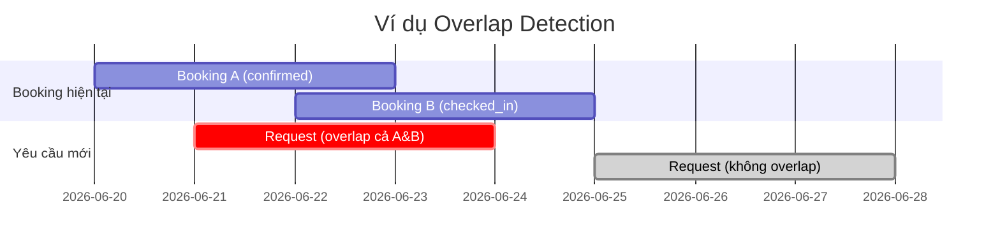
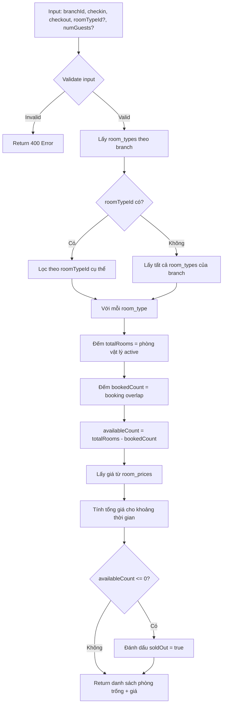
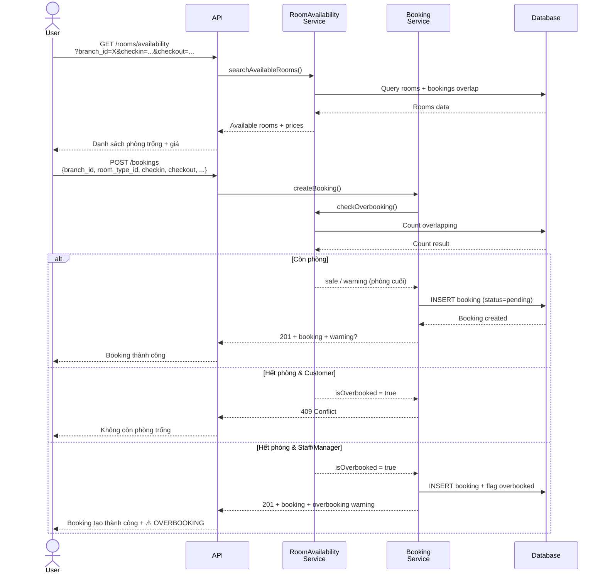

# Chức năng Đặt phòng: Tìm phòng trống & Cảnh báo Overbooking

## Bối cảnh & Phân tích Schema hiện tại

Hệ thống hiện có cấu trúc:
- **`bookings`** — lưu booking với `branch_id`, `room_type_id`, `assigned_room_id` (nullable), `checkin_at`, `checkout_at`, `status`
- **`rooms`** — phòng vật lý thuộc `branch_id` + `room_type_id`, có `status` enum (`available`, `occupied`, `cleaning`, `maintenance`, `unavailable`)
- **`room_types`** — loại phòng thuộc 1 chi nhánh, có `max_guests`
- **`room_prices`** — bảng giá theo `room_type_id`, có `price_per_day`, `price_per_hour`, `weekend_rate`, `holiday_rate`
- **`holiday_dates`** — ngày lễ theo chi nhánh (hỗ trợ tính giá ngày lễ)

### Điểm quan trọng trong schema

1. **`assigned_room_id` là nullable** → Booking có thể được tạo mà chưa gán phòng cụ thể (chỉ chọn `room_type_id`). Phòng cụ thể sẽ được gán sau (khi checkin hoặc khi confirm).
2. **`room_status`** là trạng thái vật lý tức thời, **KHÔNG** phản ánh phòng đã bị đặt trong tương lai. → Cần query bảng `bookings` để biết phòng nào đã bị chiếm trong khoảng thời gian.
3. **`booking_status`** có các trạng thái: `pending`, `confirmed`, `checked_in`, `checked_out`, `completed`, `cancelled`. Chỉ booking `cancelled` và `completed`/`checked_out` mới không chiếm phòng.

---

## Proposed Changes

### 1. Room Availability Repository Layer

#### [NEW] [roomAvailabilityRepo.ts](file:///c:/Users/Lenovo/OneDrive/Desktop/Hotel_Reservation_System/backend/src/repositories/roomAvailabilityRepo.ts)

File mới chứa các query Prisma phục vụ tìm phòng trống.

**Hàm chính:**

```typescript
// 1. Đếm tổng số phòng vật lý (is_active = true, status != maintenance/unavailable)
//    theo branch_id + room_type_id
getPhysicalRoomCount(branchId, roomTypeId)

// 2. Đếm số booking đang chiếm chỗ trong khoảng [checkin, checkout]
//    Điều kiện overlap: booking.checkin_at < checkout AND booking.checkout_at > checkin
//    Chỉ đếm booking có status IN ('pending', 'confirmed', 'checked_in')
getOverlappingBookingCount(branchId, roomTypeId, checkinAt, checkoutAt)

// 3. Lấy danh sách phòng trống cụ thể (phòng is_active mà KHÔNG có booking overlap)
getAvailableRooms(branchId, roomTypeId, checkinAt, checkoutAt)

// 4. Lấy tất cả room types có phòng trống tại 1 chi nhánh
getAvailableRoomTypes(branchId, checkinAt, checkoutAt)
```

**Thuật toán xác định phòng trống (overlap detection):**

```
Booking A chiếm phòng nếu:
  A.checkin_at < requested_checkout AND A.checkout_at > requested_checkin
  AND A.status IN ('pending', 'confirmed', 'checked_in')
```



---

### 2. Room Availability Service Layer

#### [NEW] [roomAvailabilityServices.ts](file:///c:/Users/Lenovo/OneDrive/Desktop/Hotel_Reservation_System/backend/src/services/roomAvailabilityServices.ts)

**Hàm chính:**

```typescript
// 1. Tìm phòng trống — CHỨC NĂNG CHÍNH
searchAvailableRooms(branchId, roomTypeId?, checkinAt, checkoutAt, numGuests?, bookingType?)
```

**Luồng xử lý `searchAvailableRooms`:**



**Response mẫu:**

```json
{
  "branch": { "id": "...", "name": "Chi nhánh Quận 1" },
  "checkin_at": "2026-06-25T14:00:00Z",
  "checkout_at": "2026-06-27T14:00:00Z",
  "booking_type": "daily",
  "results": [
    {
      "room_type": { "id": "...", "name": "Deluxe", "max_guests": 2, "images": [...] },
      "total_rooms": 10,
      "booked_count": 7,
      "available_count": 3,
      "is_sold_out": false,
      "price_per_unit": 500000,
      "estimated_total": 1000000,
      "available_rooms": [
        { "id": "...", "room_number": "301", "floor": 3 },
        { "id": "...", "room_number": "302", "floor": 3 },
        { "id": "...", "room_number": "405", "floor": 4 }
      ]
    },
    {
      "room_type": { "id": "...", "name": "Suite", "max_guests": 4 },
      "total_rooms": 5,
      "booked_count": 5,
      "available_count": 0,
      "is_sold_out": true,
      "price_per_unit": 1200000,
      "estimated_total": 2400000,
      "available_rooms": []
    }
  ]
}
```

---

### 3. Overbooking Warning System

#### [MODIFY] [bookingServices.ts](file:///c:/Users/Lenovo/OneDrive/Desktop/Hotel_Reservation_System/backend/src/services/bookingServices.ts)

Tích hợp kiểm tra overbooking vào `createBooking()` và `updateBooking()`.

**Logic cảnh báo overbooking:**

```typescript
// Sau khi validate input, TRƯỚC khi tạo booking:
async checkOverbooking(branchId, roomTypeId, checkinAt, checkoutAt) {
    const totalRooms = await RoomAvailabilityRepo.getPhysicalRoomCount(branchId, roomTypeId);
    const bookedCount = await RoomAvailabilityRepo.getOverlappingBookingCount(
        branchId, roomTypeId, checkinAt, checkoutAt
    );
    
    const availableCount = totalRooms - bookedCount;
    
    return {
        totalRooms,
        bookedCount,
        availableCount,
        isOverbooked: availableCount <= 0,
        overbookingLevel: availableCount < 0 
            ? 'critical'      // Đã vượt quá số phòng
            : availableCount === 0 
                ? 'warning'   // Đúng bằng số phòng (phòng cuối cùng)
                : 'safe'      // Vẫn còn phòng
    };
}
```

**Hành vi khi phát hiện overbooking:**

| Người tạo booking | `isOverbooked = true` | Hành vi |
|---|---|---|
| **Customer** (online) | Có | ❌ **Từ chối** — trả lỗi 409 Conflict |
| **Staff / Manager** | Có | ⚠️ **Cảnh báo** — vẫn cho tạo nhưng trả kèm `warning` trong response |
| **Bất kỳ ai** | Phòng cuối cùng (`availableCount === 1`) | ⚠️ **Cảnh báo** — đây là phòng cuối cùng |

> [!IMPORTANT]
> **Cần xác nhận**: Bạn muốn staff/manager có quyền tạo overbooking (cho các tình huống đặc biệt) hay muốn chặn hoàn toàn cho tất cả vai trò?

---

### 4. Controller & Route Layer

#### [NEW] [roomAvailabilityController.ts](file:///c:/Users/Lenovo/OneDrive/Desktop/Hotel_Reservation_System/backend/src/controllers/roomAvailabilityController.ts)

```typescript
class RoomAvailabilityController {
    // GET /api/rooms/availability?branch_id=...&checkin_at=...&checkout_at=...&room_type_id=...&num_guests=...&booking_type=...
    async searchAvailableRooms(req, res) { ... }
}
```

#### [MODIFY] [bookingRoutes.ts](file:///c:/Users/Lenovo/OneDrive/Desktop/Hotel_Reservation_System/backend/src/routes/bookingRoutes.ts) hoặc [NEW] route mới

Thêm endpoint mới:

```
GET  /api/rooms/availability   — Tìm phòng trống (public, cho khách hàng)
```

#### [MODIFY] [bookingController.ts](file:///c:/Users/Lenovo/OneDrive/Desktop/Hotel_Reservation_System/backend/src/controllers/bookingController.ts)

Cập nhật `createBooking` response để bao gồm warning nếu có overbooking.

---

### 5. Cập nhật Booking Flow tổng thể

Luồng đặt phòng đầy đủ sau khi triển khai:



---

### 6. Xử lý Race Condition (Đặt phòng đồng thời)

> [!WARNING]
> Khi 2 khách đặt phòng cuối cùng cùng lúc, cả 2 đều thấy "còn 1 phòng" → cả 2 đều tạo booking → **overbooking**.

**Giải pháp đề xuất: Pessimistic Locking với Prisma Transaction**

```typescript
// Trong createBooking():
await prisma.$transaction(async (tx) => {
    // 1. Lock bằng cách SELECT ... FOR UPDATE (raw query)
    //    Lock các booking rows liên quan để ngăn concurrent read
    await tx.$queryRaw`
        SELECT id FROM rooms 
        WHERE branch_id = ${branchId} 
        AND room_type_id = ${roomTypeId} 
        FOR UPDATE
    `;
    
    // 2. Đếm lại availability trong transaction
    const available = await countAvailable(tx, branchId, roomTypeId, checkin, checkout);
    
    // 3. Nếu còn phòng → INSERT booking
    if (available > 0) {
        return await tx.bookings.create({ data: bookingData });
    } else {
        throw new Error('No rooms available');
    }
});
```

> [!IMPORTANT]
> **Cần xác nhận**: Bạn muốn sử dụng Pessimistic Locking (an toàn hơn, nhưng có thể chậm khi traffic cao) hay Optimistic Locking (check sau khi insert, nếu overbooking thì rollback)?

---

## Open Questions

> [!IMPORTANT]
> **1. Quyền overbooking**: Staff/Manager có được phép tạo booking khi đã hết phòng không? Hay chặn hoàn toàn?

> [!IMPORTANT]
> **2. Concurrency strategy**: Bạn thích Pessimistic Lock (SELECT FOR UPDATE) hay Optimistic Lock (check-then-insert, retry nếu conflict)?

> [!NOTE]
> **3. Gán phòng cụ thể**: Khi nào nên gán `assigned_room_id`?
> - **Option A**: Gán ngay khi tạo booking (tự động chọn phòng trống)
> - **Option B**: Không gán khi tạo, chỉ gán khi staff confirm hoặc khi khách checkin
> - **Option C**: Tùy chọn — customer đặt online thì chưa gán, staff đặt tại quầy thì gán luôn

> [!NOTE]
> **4. Giá cuối tuần/lễ**: Hiện tại `generateSubtotal()` chưa tính `weekend_rate` và `holiday_rate` từ `room_prices` và `holiday_dates`. Bạn có muốn tích hợp luôn tính năng này vào kế hoạch lần này không?

---

## Tóm tắt các file thay đổi

| Hành động | File | Mô tả |
|---|---|---|
| **NEW** | `repositories/roomAvailabilityRepo.ts` | Query tìm phòng trống, đếm overlap |
| **NEW** | `services/roomAvailabilityServices.ts` | Logic tìm phòng, tính giá, format kết quả |
| **NEW** | `controllers/roomAvailabilityController.ts` | Handler cho endpoint tìm phòng |
| **MODIFY** | `services/bookingServices.ts` | Thêm overbooking check vào `createBooking` và `updateBooking` |
| **MODIFY** | `controllers/bookingController.ts` | Cập nhật response format có warning |
| **MODIFY** | `routes/bookingRoutes.ts` hoặc **NEW** route | Thêm `GET /rooms/availability` |
| **MODIFY** | `routes/index.ts` | Đăng ký route mới |

---

## Verification Plan

### Automated Tests

```bash
# Test 1: Tìm phòng trống khi không có booking nào
# Test 2: Tìm phòng trống khi có booking overlap
# Test 3: Tìm phòng trống khi tất cả phòng đều bị đặt
# Test 4: Cảnh báo overbooking khi tạo booking hết phòng
# Test 5: Edge case — booking cancelled không chiếm chỗ
# Test 6: Edge case — checkin/checkout trùng ranh giới (boundary)
npm test -- --testPathPattern=roomAvailability
```

### Manual Verification

- Tạo dữ liệu test với nhiều phòng và booking
- Gọi API tìm phòng trống với các khoảng thời gian khác nhau
- Tạo booking khi chỉ còn 1 phòng → verify warning
- Tạo booking khi hết phòng → verify lỗi 409
